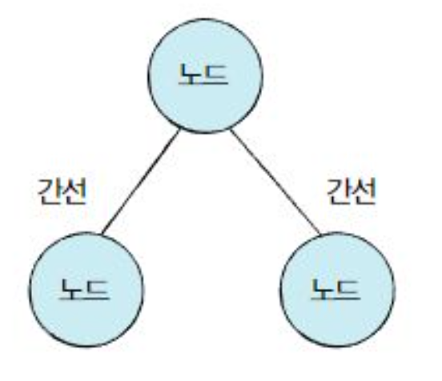
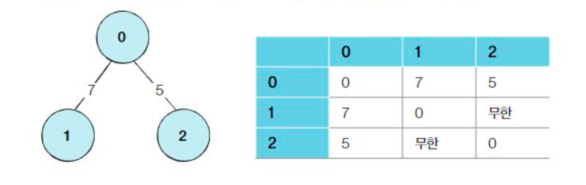

# DFS
---
DFS란 Depth-First Search로 깊이 우선탐색으로 부른다.
그래프에서 깊은 부분을 우선적으로 탐색하는 알고리즘이다.
##그래프의 기본구조

그래프는 노드와 간선으로 표현
이때 노드를 정점이라고도 한다.
ex) 노드 = 도시, 간선 = 도로
A라는 도시에서 B라는 도시로 이동하기 위해서, A와 B를 연결하는 도로를 거친다

---
입접행렬(Adjacency Matrix): 2차원 배열로 그래프의 연결 관계를 표현하는 방식
인접 리스트(Adjacency List): 리스트로 그래프의 연결 관계를 표현하는 방식

